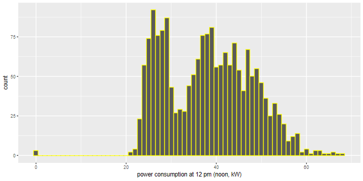
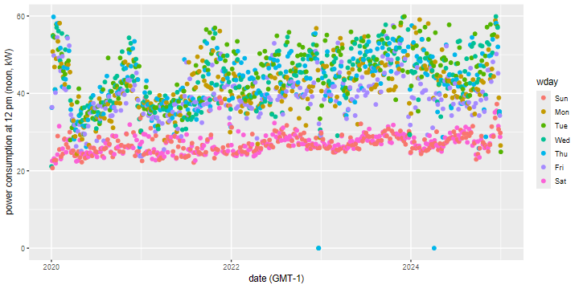

# mpipcon_data_analysis
power consumption data analysis

__What information can we derive from the 15-minute grid data on electricity consumption?__

A first example program 

* retrieve the dataset from the edmond dataverse repository

* store a copy locally

* read the dataset

* cleaning up the date/time information

* create some example graphs with ggplot2

The following histogram shows electricity consumption at 12 noon.

The next chart shows electricity consumption at 12 noon, grouped by day of the week.

